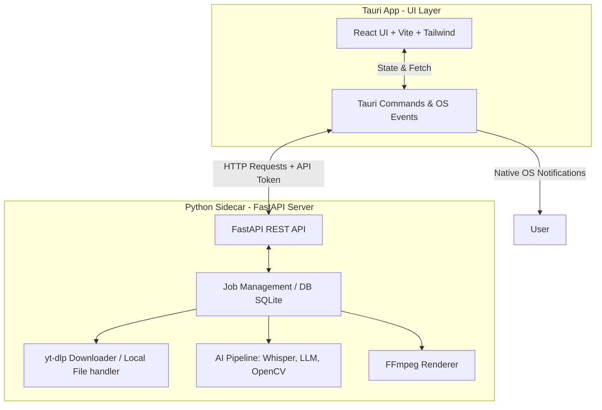
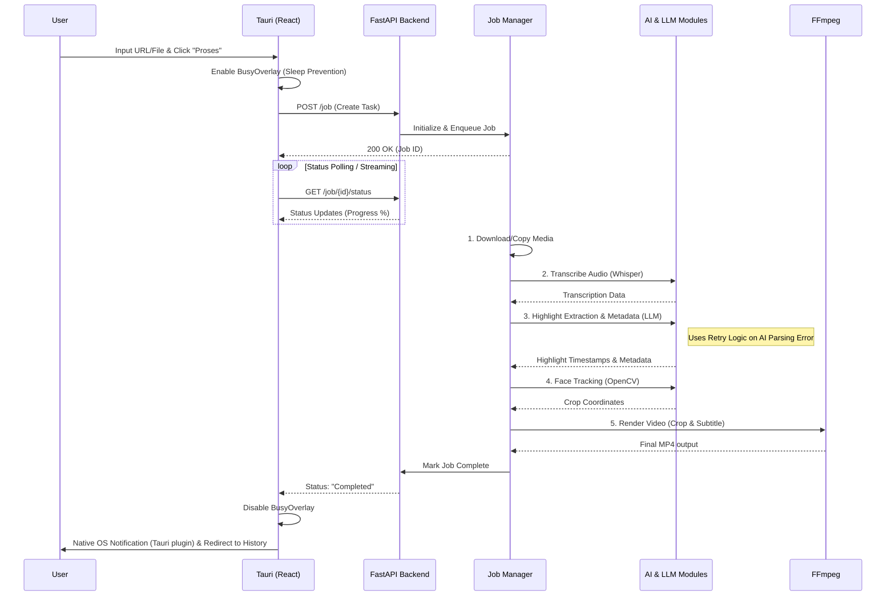

# Technical Design Document - Auto Clipper

Dokumen ini menjelaskan arsitektur teknis, diagram alur, dan interaksi komponen dalam aplikasi Auto Clipper.

## 1. High-Level Architecture

Aplikasi ini menggunakan model **Sidecar Architecture**, tetapi alih-alih hanya mengeksekusi skrip secara pasif, Sidecar Python beroperasi sebagai **Server API Lokal (FastAPI)**. Antarmuka pengguna (Frontend Tauri) dan mesin pemrosesan berinteraksi melalui HTTP REST API dan Token Autentikasi.

## 2. Alur Pemrosesan Video (Video Processing Flow)

Pekerjaan (Jobs) diatur oleh modul *Job Management* di Python. Sistem ini tangguh berkat adanya *retry logic* saat ekstraksi LLM dan penanganan background agar sistem operasi tidak tidur (Sleep Prevention / BusyOverlay).

## 3. Struktur Direktori Utama

- `src/`: Berisi kode sumber Frontend (React, Vite, Tailwind). Komponen UI, state management, dan modul i18n (Internationalization) ada di sini.
- `src-tauri/`: Kode Rust yang membungkus aplikasi web menjadi *desktop app*. Mendefinisikan kapabilitas *Native Notifications*, konfigurasi *sleep prevention*, dan eksekusi *sidecar* (`tauri.conf.json`).
- `backend/`: Kode Python (FastAPI). 
  - `main.py`: Entry point server web lokal.
  - `jobs.py`: Scheduler dan handler untuk setiap jenis antrean pemrosesan.
  - `ai_utils.py`: Logika interaksi AI (Whisper, LLM) yang dilengkapi metode fallback/retry.
  - `db.py`: Koneksi dan model SQLite untuk riwayat.
- `bin/`: Direktori tempat executable *sidecar* dari PyInstaller disimpan (`backend-x86_64-pc-windows-msvc.exe`) sebelum dipanggil oleh Tauri.

## 4. Inter-Process Communication (IPC) & Keamanan

Komunikasi antara UI (Tauri) dan backend (Python) tidak lagi menggunakan *Standard Input/Output (stdio)* mentah. Saat Tauri dijalankan, ia membangunkan sidecar FastAPI di port lokal secara dinamis.

- **HTTP REST API**: Frontend Tauri melakukan inisiasi data (seperti URL/Video Path) melalui Endpoint POST, dan membaca *progress state* melalui Endpoint GET (Polling/Streaming).
- **Keamanan Token Lokal**: Untuk memastikan *sidecar* FastAPI ini aman (tidak ditembak oleh aplikasi browser lain di OS yang sama), akses ke Endpoint tertentu dibentengi oleh `API_SECRET_TOKEN` yang di-generate dinamis secara lokal pada saat inisiasi dan divalidasi oleh *middleware* FastAPI (kecuali di mode development `npm run dev`).
- **Sleep Prevention & OS Notifications**: Ketika backend sibuk merender, Tauri di sisi frontend menjaga OS agar tidak masuk status *Sleep* (melalui library terkait atau API native Tauri). Begitu server merespons "Selesai", Tauri akan membunyikan Notifikasi OS (OS Level, bukan HTML Web Toast biasa) yang mendukung multi-bahasa sesuai pengaturan *locale* user.
